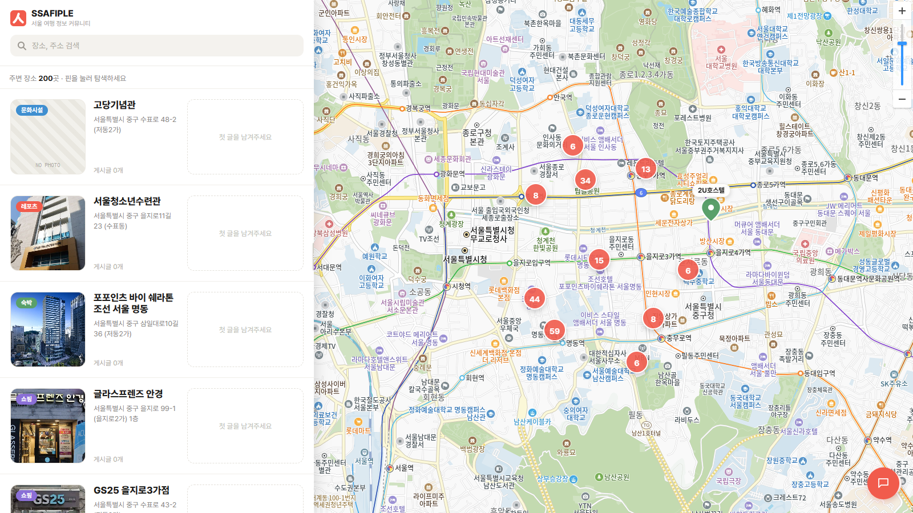
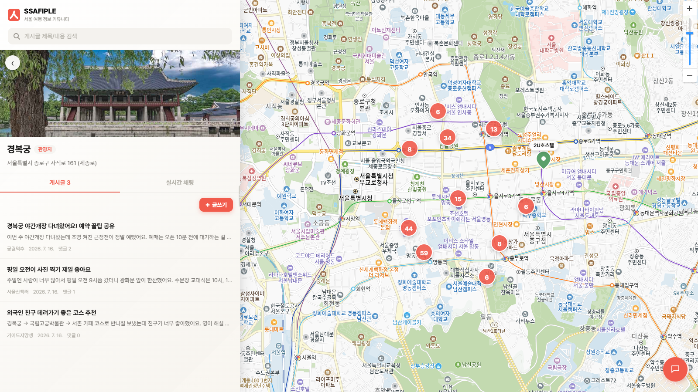
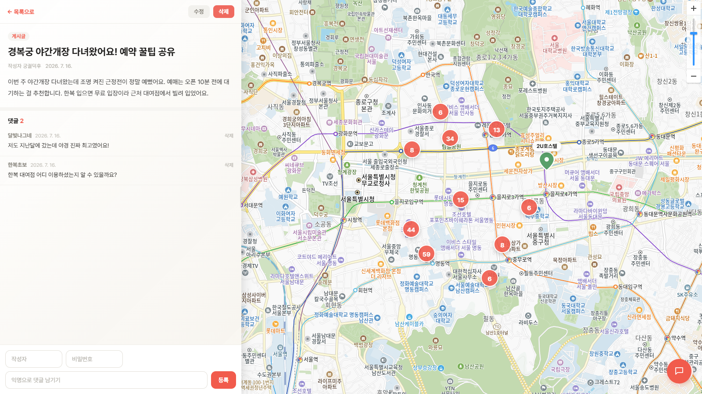
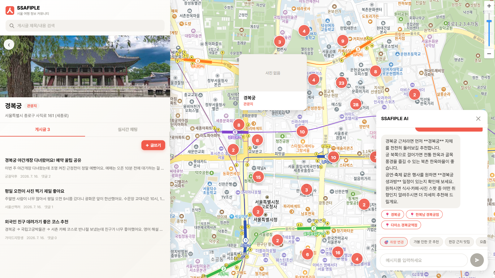
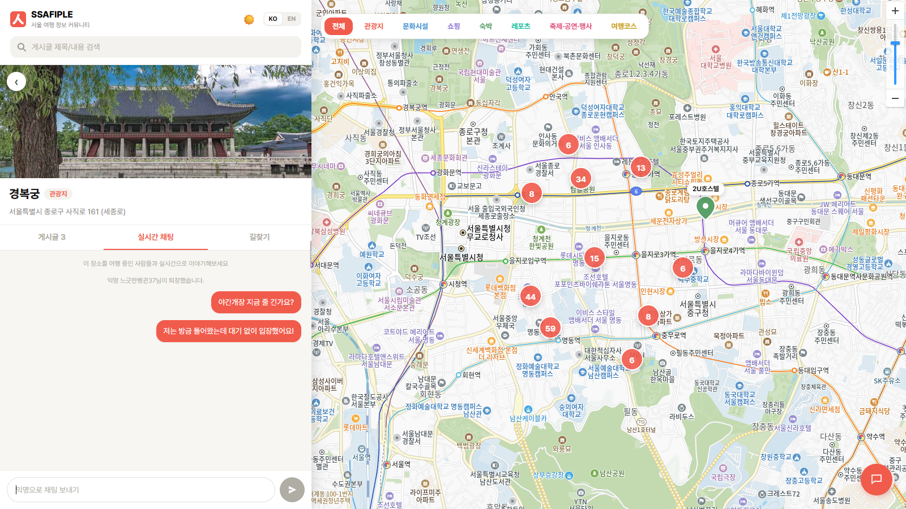

<p align="center">
  <a href="https://ssafiple.netlify.app/">
    
  </a>
</p>

<p align="center">
  <a href="https://ssafiple.netlify.app/"><b>🌐 웹사이트 바로가기</b></a>
</p>

<h1 align="center">SSAFIPLE</h1>

<p align="center">
  <b>서울을 여행하는 사람들을 위한 장소 탐색 · 익명 커뮤니티 · AI 여행 비서 서비스</b><br/>
  Vue 3 · FastAPI · SQLite · Kakao Maps · OpenAI
</p>

---

## 1. SSAFIPLE은 무엇인가요?

SSAFIPLE은 **서울 권역의 관광지·음식점·문화시설·쇼핑·숙박 정보를 지도 위에서 탐색하고, 장소마다 열려 있는 익명 게시판과 실시간 채팅으로 방문 경험을 나누는 지역 정보 공유 커뮤니티**입니다. 여기에 서울 여행 질문에 답하고 추천 장소를 지도와 바로 연결해 주는 AI 여행 비서가 함께 제공됩니다.

### 왜 만들었나요?

서울 관광 정보는 한국관광공사 TourAPI 등 공공데이터로 이미 풍부하게 공개되어 있지만, 데이터 그 자체는 "지금 가볼 만한가?"라는 질문에 답해 주지 못합니다. SSAFIPLE은 이 간극을 세 가지로 메웁니다.

1. **공공데이터를 지도 경험으로** — 흩어진 JSON 데이터를 검증·적재해 카카오 지도 위에서 카테고리별로 한눈에 탐색할 수 있게 했습니다.
2. **장소 중심의 소통** — 게시판이 서비스 전체에 하나 있는 것이 아니라, **장소마다** 익명 게시판과 실시간 채팅방이 붙어 있습니다. "경복궁" 핀을 누르면 경복궁에 대한 글과 대화만 모여 있습니다.
3. **대화형 탐색** — "성수동 근처 전시 볼 만한 곳 있어?" 같은 자연어 질문에 AI 비서가 실제 DB에 존재하는 장소만 근거로 답하고, 답변 속 장소를 클릭하면 지도가 그 위치로 이동합니다.

회원가입·로그인이 없는 **완전 익명 서비스**로, 누구나 진입 장벽 없이 바로 참여할 수 있습니다.



---

## 2. 주요 기능

### 🗺️ 지도 기반 장소 탐색
- Kakao Maps JS SDK로 서울 전역의 장소를 핀 마커로 시각화 (관광지 / 음식점 / 문화시설 / 쇼핑 / 숙박 카테고리별 색상 구분)
- 지도 이동(Bounds) 기반 재조회 + limit 제한으로 대용량 데이터도 끊김 없이 로드
- 장소명·주소 키워드 검색, 카테고리 필터, 마커 클러스터링, 좌측 목록 패널 무한 스크롤
- 좌측 60% 목록/상세 패널 + 우측 40% 지도 뷰포트의 스플릿 레이아웃

### 📝 장소별 익명 게시판
- 장소 상세에서 진입하는 `location_id` 단위 게시판 — 글/댓글 CRUD, 이미지 첨부
- 회원가입 없이 닉네임 + 비밀번호만으로 작성하고, 비밀번호 일치 시에만 수정/삭제
- 물리 삭제 대신 **소프트 딜리트**(`is_deleted`) 적용, 게시글 삭제 시 댓글도 연쇄(CASCADE) 처리

| 장소별 게시판 목록 | 게시글 상세 · 댓글 |
|---|---|
|  |  |

### 🤖 AI 여행 비서 (플로팅 챗봇)
- 우측 하단 플로팅 위젯에서 대화 히스토리를 유지하며 서울 여행 질문에 응답
- **임베딩 기반 RAG**: 사전 구축한 장소 임베딩 인덱스(`backend/data/location_embeddings.npz`)에서 질문과 유사한 장소를 검색해 실제 DB 데이터만 근거로 답변 (환각 방지 프롬프트 규칙 적용)
- 답변 속 **볼드 처리된 장소명은 지도 이동 신호** — 클릭하면 해당 장소로 지도가 이동
- OpenAI 키 미설정 시 데모 모드 안내로 폴백



### 💬 장소별 실시간 익명 채팅 (WebSocket)
- 장소 상세 화면에서 게시판과 분리된 실시간 채팅 탭 제공
- FastAPI WebSocket(`/api/chat/ws/{location_id}`)으로 장소별 Pub/Sub 채널 운영
- 접속 시 랜덤 닉네임 자동 발급, 입장/퇴장 시스템 메시지, 최근 메시지 이력 조회 지원



> 🎨 실제 구현 스크린샷은 [`docs/screenshots/`](docs/screenshots), 초기 디자인 시안은 [`docs/design_draft/screenshots/`](docs/design_draft/screenshots)에서 확인할 수 있습니다.

---

## 3. 기술 스택 및 아키텍처

| 구분 | 기술 |
|---|---|
| Frontend | Vue 3 (Composition API), Vite, Pinia, Vue Router, Axios |
| Backend | FastAPI, SQLAlchemy, Pydantic, WebSocket |
| Database | SQLite (파일 기반, `backend/localhub.db`) |
| AI | OpenAI Chat Completions + `text-embedding-3-small` 임베딩 검색(RAG) |
| 지도 | Kakao Maps JS SDK |
| 배포 | Netlify (FE) · Render (BE) · GitLab CI → GitHub 미러링 |

### 폴더 구조 (도메인별 풀스택)

```text
team_project/
├── docs/                      # 설계 문서 (SCHEMA, SOURCE, COOPERATION, TEST_PLAN, 디자인 시안)
├── data/raw/                  # 원본 공공데이터 JSON (서울_관광지, 음식점, 문화시설 등)
├── frontend/                  # Vue 3 SPA
│   ├── src/
│   │   ├── components/        # 도메인별 UI 컴포넌트 (map, board, chat, common)
│   │   ├── pages/             # 화면 뷰 (MapView, PostListView, PostDetailView 등)
│   │   ├── router/            # Vue Router 설정
│   │   ├── stores/            # Pinia 전역 스토어
│   │   └── utils/             # Axios 인스턴스 등 공통 유틸
│   └── public/_redirects      # Netlify SPA 새로고침 404 방지
└── backend/                   # FastAPI 서버
    ├── app/
    │   ├── core/config.py     # 환경변수 로더
    │   ├── database.py        # SQLite 연결
    │   ├── models/            # SQLAlchemy 모델 (Location, Post, Comment, ChatMessage)
    │   ├── schemas/           # Pydantic DTO
    │   ├── routers/           # /api 하위 도메인 라우터 (locations, posts, comments, chat)
    │   ├── services/          # 비즈니스 로직 (챗봇 RAG, 채팅 메시지 저장 등)
    │   └── utils/             # WebSocket 커넥션 매니저 등
    ├── data/                  # 장소 임베딩 인덱스 (location_embeddings.npz)
    └── scripts/               # seed.py (DB 시딩), build_location_embeddings.py
```

### 어떻게 만들었나요? — 설계 결정 요약

- **도메인별 풀스택 분할 (Vertical Slicing)**: 프론트/백엔드 레이어로 팀을 나누는 대신 `지도`·`게시판`·`AI/채팅` 3개 도메인으로 나누고, 각 담당이 FE 화면부터 BE 라우터·DB 모델까지 수직으로 소유합니다. AI 에이전트 페어 개발 환경에서 맥락 유지와 병합 충돌 차단에 유리한 구조입니다. (상세: [docs/COOPERATION.md](docs/COOPERATION.md))
- **경량 단일 레포**: Nx/Turborepo 같은 오케스트레이터 없이 폴더 구분만 둔 구조. 외부 DB 없이 파일 기반 SQLite를 사용해 클론 후 바로 실행됩니다.
- **데이터 파이프라인 검증**: 공공데이터 적재 시 위·경도가 뒤바뀌는 사고를 막기 위해 `seed.py`가 서울 권역 경계(위도 37.40–37.72, 경도 126.75–127.20)를 벗어난 좌표를 강제 검증(Assert)합니다. 서버 기동 시 자동 시딩되어 Render 무료 플랜의 휘발성 DB에도 대응합니다.
- **API 규칙**: 모든 REST 엔드포인트는 `/api` prefix 하위로 통일 (`/api/locations`, `/api/posts`, `/api/comments`, `/api/chat`). 업로드 정적 파일만 예외로 `/uploads/` 경로에서 서빙됩니다.

DB 상세 스키마는 [docs/SCHEMA.md](docs/SCHEMA.md), 테스트 명세는 [docs/TEST_PLAN.md](docs/TEST_PLAN.md)를 참고하세요.

---

## 4. 실행 방법

### 사전 준비
- Python 3.11+, Node.js 20+
- (선택) OpenAI API Key — 없으면 챗봇이 데모 모드로 동작
- Kakao Developers에서 발급한 JavaScript 키 — 지도 표시에 필요

### 1) Backend (FastAPI)

```bash
cd backend
python -m venv .venv
.venv\Scripts\Activate.ps1        # Windows (macOS/Linux: source .venv/bin/activate)
pip install -r requirements.txt
cp .env.example .env              # OPENAI_API_KEY 등 기재
python scripts/seed.py            # 공공데이터 JSON → SQLite 적재 (서버 기동 시 자동 시딩도 수행)
uvicorn app.main:app --reload
```

- API 서버: `http://localhost:8000`
- **Swagger 문서**: `http://localhost:8000/docs`

### 2) Frontend (Vue 3)

```bash
cd frontend
npm install
cp .env.example .env              # VITE_KAKAO_MAP_KEY, VITE_API_BASE_URL 기재
npm run dev
```

- 웹 서비스: `http://localhost:5173`
- 디자인 시스템/공통 컴포넌트 예제: `http://localhost:5173/example`

### 3) 백엔드 테스트

```bash
cd backend
python -m unittest discover -s tests -v
```

---

## 5. 배포

| 대상 | 플랫폼 | 설정 파일 |
|---|---|---|
| Frontend | Netlify | `netlify.toml` + `frontend/public/_redirects` (SPA 새로고침 404 방지) |
| Backend | Render | `render.yaml` (Uvicorn 기동, CORS 도메인 제한) |

**GitLab → GitHub 자동 미러링**: `.gitlab-ci.yml`이 내부 GitLab 푸시마다 GitHub 원격 저장소로 자동 동기화합니다. GitLab의 `Settings → CI/CD → Variables`에 `GITHUB_USERNAME`, `GITHUB_PAT`, `GITHUB_REPO_NAME`을 등록하면 활성화됩니다.

---

## 6. 데이터 출처 및 라이선스

- 장소 데이터는 **한국관광공사 TourAPI(4.0)** 등 공공데이터포털·서울열린데이터광장의 서울 관광 정보를 사용합니다. 원본 JSON은 `data/raw/`에 원형 그대로 보관하며 변경 없이 적재합니다.
- **공공누리(공공저작물 자유이용허락)** 라이선스에 따라 서비스 푸터에 출처 문안을 상시 표기합니다.
  > "이 서비스는 한국관광공사 Tour API(TourAPI 4.0)의 데이터를 활용하였습니다. 출처: 한국관광공사 / 라이선스: 공공누리 제3유형"
- 상세 내용: [docs/SOURCE.md](docs/SOURCE.md)

---

## 7. ⚠️ 알아두어야 할 제약 사항

1. **비밀번호 평문 저장**: 회원가입 없는 익명 게시판 특성상 게시글/댓글 비밀번호는 암호화 없이 평문으로 저장·비교합니다. **교육 목적의 의도된 명세 설계**이며, 실서비스 패턴이 아닙니다. (API 키 등 그 외 민감정보는 `.env`로 격리)
2. **Kakao Maps 키 노출**: JS SDK 특성상 키가 브라우저에 노출됩니다. 카카오 개발자 콘솔의 Web 플랫폼 도메인 등록(`localhost`, Netlify 배포 도메인)으로 남용을 차단해야 합니다.
3. **Render 무료 플랜 휘발성**: `backend/uploads/`의 업로드 이미지와 SQLite DB 파일은 재배포/재시작 시 초기화될 수 있습니다. (DB는 기동 시 자동 시딩으로 복원)
4. **인증 없음**: 전 기능이 익명으로 동작합니다. 접근 제어가 필요한 용도로는 설계되지 않았습니다.

---

## 8. 프로젝트 문서

| 문서 | 내용 |
|---|---|
| [AGENTS.md](AGENTS.md) | AI 에이전트 공통 개발 규칙 (제약사항·커밋 스타일·협업 원칙 마스터 문서) |
| [CLAUDE.md](CLAUDE.md) | Claude Code 진입점 (서브에이전트·스킬·문서 인덱스) |
| [docs/COOPERATION.md](docs/COOPERATION.md) | 3인 도메인 분배 및 단일 스트림 협업 전략 |
| [docs/SCHEMA.md](docs/SCHEMA.md) | DB 테이블 명세 |
| [docs/SOURCE.md](docs/SOURCE.md) | 데이터 출처·라이선스 |
| [docs/TEST_PLAN.md](docs/TEST_PLAN.md) | 단위/통합 테스트 명세 |
